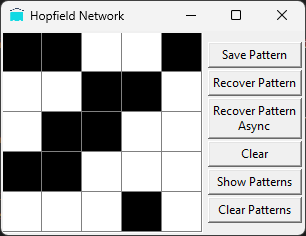
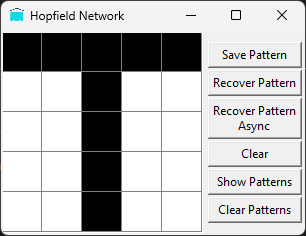

# Perceptron
## Popis problému
Cílem bylo predikovat, zda se bod nachází pod, nad nebo přímo na přímce:
- Pod přímkou: Label **-1**
- Nad přímkou: Label **1**
- Na přímce: Label **0**

## Proces implementace
1. **Příprava komponent**:
   - Implementace aktivační funkce, vah a biasu.
   
2. **Implementace trénovací metody (`fit`)**:
   - Inicializace vah a biasu.
   - Iterace přes trénovací data v několika epochách.
   - Výpočet predikce a určení chyby oproti skutečné hodnotě.
   - Aktualizace vah a biasu na základě chyby.

3. **Implementace predikční metody (`predict`)**:
   - Výpočet výstupu pomocí vstupu, vah a biasu.
   - Aplikace aktivační funkce pro získání finální predikce.

## Výsledek
Perceptron správně klasifikuje body podle rovnice přímky a dokáže nalézt odpovídající rozhodovací hranici.

---

# XOR problém
## Popis problému
Cílem bylo předpovědět výsledek logické operace XOR, kterou nelze řešit jednoduchým perceptronem, protože není lineárně separovatelná. 

Řešením bylo vytvoření malé neuronové sítě, která rozdělí problém na menší části pomocí více rozhodovacích hranic.

## Proces implementace
1. **Struktura sítě**:
   - Vytvoření tříd: `Neuron`, `Layer` a `NeuralNetwork`.
   - Rozdělení sítě na vrstvy: skrytá vrstva (2 Neurony) a výstupní vrstva (1 Neuron).

2. **Trénovací metoda (`fit`)**:
   - Propagace vstupních dat skrz síť a získání výsledků.
   - Výpočet chyb pomocí zpětné propagace (backpropagation).
   - Aktualizace vah a biasů na základě chyby.

3. **Predikční metoda (`predict`)**:
   - Propagace vstupu sítí až k výstupu.
   - Vrácení výsledku z poslední vrstvy.

## Výsledek
Neuronová síť správně naučila operaci XOR a dokáže ji přesně klasifikovat.

# Hopfield Network
## Popis problému
Cílem bylo vytvořit Hopfieldovu síť, která dokáže ukládat a následně rekonstruovat binární vzory. Síť funguje jako asociativní paměť, která se dokáže vrátit k nejbližšímu uloženému vzoru i při částečně poškozeném vstupu.

## Proces implementace
1. **Struktura sítě**:
   - Implementace třídy `HopfieldNetwork` s metodami pro učení a rekonstrukci vzorů.
   - Reprezentace neuronů pomocí binárních hodnot (1 a -1).

2. **Trénovací metoda (`train`)**:
   - Použití Hebbova pravidla pro aktualizaci vah.
   - Vytvoření symetrické váhové matice bez vlastních smyček.

3. **Rekonstrukční metoda (`recall`)**:
   - Iterativní aktualizace stavů neuronů na základě vstupního vzoru.
   - Stabilizace sítě do jednoho z uložených vzorů.

### Synchronní a Asynchronní Aktualizace

**Synchronní aktualizace**:
- Všechny neurony v síti jsou aktualizovány současně v jednom kroku.
- Tento přístup může vést k rychlejší stabilizaci sítě, ale někdy může způsobit oscilace nebo nestabilitu, pokud jsou vzory příliš složité nebo konfliktní.

**Asynchronní aktualizace**:
- Neurony se aktualizují postupně, jeden po druhém, v náhodném nebo předem definovaném pořadí.
- Tento přístup často umožňuje lepší konvergenci k uloženým vzorům, protože eliminuje možnost oscilací způsobených současnou aktualizací všech neuronů.
- Je také biologicky realističtější, protože v biologických neuronových sítích neurony nepracují synchronně.

## Výsledek
Hopfieldova síť úspěšně ukládá a rekonstruuje binární vzory. Dokáže opravit poškozené vstupy a vrátit se k nejbližšímu uloženému vzoru.

## Obrázky
### Hopfieldova síť - Před a po Rekonstrukci

