# Perceptron
## Popis problému
Cílem bylo predikovat, zda se bod nachází pod, nad nebo přímo na přímce:
- Pod přímkou: Label **-1**
- Nad přímkou: Label **1**
- Na přímce: Label **0**

## Proces implementace
1. **Příprava komponent**:
   - Implementace aktivační funkce, vah a biasu.
   
2. **Implementace trénovací metody (`fit`)**:
   - Inicializace vah a biasu.
   - Iterace přes trénovací data v několika epochách.
   - Výpočet predikce a určení chyby oproti skutečné hodnotě.
   - Aktualizace vah a biasu na základě chyby.

3. **Implementace predikční metody (`predict`)**:
   - Výpočet výstupu pomocí vstupu, vah a biasu.
   - Aplikace aktivační funkce pro získání finální predikce.

## Výsledek
Perceptron správně klasifikuje body podle rovnice přímky a dokáže nalézt odpovídající rozhodovací hranici.

---

# XOR problém
## Popis problému
Cílem bylo předpovědět výsledek logické operace XOR, kterou nelze řešit jednoduchým perceptronem, protože není lineárně separovatelná. 

Řešením bylo vytvoření malé neuronové sítě, která rozdělí problém na menší části pomocí více rozhodovacích hranic.

## Proces implementace
1. **Struktura sítě**:
   - Vytvoření tříd: `Neuron`, `Layer` a `NeuralNetwork`.
   - Rozdělení sítě na vrstvy: skrytá vrstva (2 Neurony) a výstupní vrstva (1 Neuron).

2. **Trénovací metoda (`fit`)**:
   - Propagace vstupních dat skrz síť a získání výsledků.
   - Výpočet chyb pomocí zpětné propagace (backpropagation).
   - Aktualizace vah a biasů na základě chyby.

3. **Predikční metoda (`predict`)**:
   - Propagace vstupu sítí až k výstupu.
   - Vrácení výsledku z poslední vrstvy.

## Výsledek
Neuronová síť správně naučila operaci XOR a dokáže ji přesně klasifikovat.


# Hopfield Network
## Popis problému
Cílem bylo vytvořit Hopfieldovu síť, která dokáže ukládat a následně rekonstruovat binární vzory. Síť funguje jako asociativní paměť, která se dokáže vrátit k nejbližšímu uloženému vzoru i při částečně poškozeném vstupu.

## Proces implementace
1. **Struktura sítě**:
   - Implementace třídy `HopfieldNetwork` s metodami pro učení a rekonstrukci vzorů.
   - Reprezentace neuronů pomocí binárních hodnot (1 a -1).

   ```python
   class HopfieldNetwork:
      def __init__(self, size):
         self.size = size
         self.weights = None
         self.pattern_weights = None
   ```

2. **Trénovací metoda (`train`)**:
   - Použití Hebbova pravidla pro aktualizaci vah.
   - Vytvoření symetrické váhové matice bez vlastních smyček.

   ```python
   def train(self, patterns):
      self.weights = np.zeros((self.size, self.size))
      self.pattern_weights = []
      
      for pattern in patterns:
         # Konverze na binární reprezentaci (1 a -1)
         pattern = np.where(pattern.flatten() > 0, 1, -1).reshape(-1, 1)
         
         # Výpočet váhové matice pro daný vzor pomocí vnějšího součinu
         pattern_weight = pattern @ pattern.T
         
         # Přidání do celkové váhové matice
         self.weights += pattern_weight
         self.pattern_weights.append(pattern_weight)
      
      # Odstranění vlastních smyček (nulová diagonála)
      np.fill_diagonal(self.weights, 0)
   ```

3. **Rekonstrukční metoda (`recall`)**:
   - Iterativní aktualizace stavů neuronů na základě vstupního vzoru.
   - Stabilizace sítě do jednoho z uložených vzorů.

   ```python
   def recover(self, pattern, steps=5, async_method=False):
      pattern = pattern.flatten()

      if async_method:
         # Asynchronní aktualizace - jeden neuron po druhém
         for _ in range(steps):
               for i in range(self.size):
                  pattern[i] = np.sign(np.dot(self.weights[i], pattern))
      else:
         # Synchronní aktualizace - všechny neurony najednou
         for _ in range(steps):
               pattern = np.sign(self.weights @ pattern)
      
      # Přetvarování výsledku zpět na 2D matici
      return pattern.reshape(int(np.sqrt(self.size)), -1)
   ```

### Synchronní a Asynchronní Aktualizace

**Synchronní aktualizace**:
- Všechny neurony v síti jsou aktualizovány současně v jednom kroku.
- Implementováno pomocí maticového násobení: `pattern = np.sign(self.weights @ pattern)`
- Může být rychlejší pro výpočet, ale někdy vede k oscilacím stavu místo konvergence.

**Asynchronní aktualizace**:
- Neurony se aktualizují postupně, jeden po druhém.
- Implementováno pomocí cyklu přes všechny neurony: `pattern[i] = np.sign(np.dot(self.weights[i], pattern))`
- Tento přístup často umožňuje lepší konvergenci k uloženým vzorům.

## Výsledek
Hopfieldova síť úspěšně ukládá a rekonstruuje binární vzory. Dokáže opravit poškozené vstupy a vrátit se k nejbližšímu uloženému vzoru.

## Obrázky
### Hopfieldova síť - Před a po Rekonstrukci


# QLearning
## Popis problému
Cílem bylo implementovat algoritmus Q-Learning, který umožňuje agentovi (hráči) naučit se optimální strategii pro dosažení cíle v prostředí s odměnami a penalizacemi.

## Proces implementace
1. **Struktura programu**:
   - `qlearning_player`: Třída reprezentující hráče, který se učí na základě Q-Learning algoritmu.
   - `q_table`: Tabulka Q-hodnot, která uchovává odhady budoucích odměn pro jednotlivé akce ve stavech.
   - `qlearning_app`: Aplikace, která simuluje prostředí a umožňuje interakci hráče s prostředím.

2. **Algoritmus Q-Learning**:
   - Inicializace Q-tabulky s nulovými hodnotami.
   - Iterativní učení na základě interakce hráče s prostředím:
     - Hráč pozoruje aktuální stav.
     - Na základě Q-hodnot a průzkumné strategie (např. greedy) vybírá akci.
     - Prostředí vrací odměnu a nový stav.
     - Aktualizace Q-hodnot podle rovnice.

      ### Princip trénování

      Trénování je založeno na implementaci Q-Learning algoritmu. Tento algoritmus umožňuje agentovi iterativně zlepšovat své rozhodování na základě zkušeností získaných interakcí s prostředím.

      #### Hlavní kroky trénování:
      1. **Inicializace Q-tabulek**:
         - Q-tabulka je reprezentována jako slovník s stavem kolem hrače a hodnoty jsou Q-hodnoty.

      2. **Výběr akce**:
         - Agent vybírá akci na základě greedy strategie:
           - S pravděpodobností ε zvolí náhodnou akci (průzkum).
           - Jinak zvolí akci s nejvyšší Q-hodnotou (exploatace).

         ```python
         if random.random() <= self.table.epsilon:
            selected_action = random.choice(actions)
            selected_by_random = True
         else:            
            selected_value = -1
            for i, s_value in enumerate(current_state_data):
                if s_value > selected_value:
                    selected_action = actions[i]
                    selected_value = s_value
         ```

       - Po provedení akce agent obdrží odměnu a přejde do nového stavu.

      3. **Aktualizace Q-Hodnoty**:
         ```python
         reward = self.get_reward(self.last_action, self.last_state)

         last_state_data = self.table.get(self.last_state)
         last_value = last_state_data[actions.index(self.last_action)]            
         new_value = (1 - self.learning_rate) * last_value + self.learning_rate * (reward + max_value * 0.6)
         last_state_data[actions.index(self.last_action)] = new_value
         self.table.set(self.last_state, last_state_data)
         ```
       - Kde:
         - `reward` je odměna získaná za provedenou akci.
         - `last_state_data` obsahuje Q-hodnoty pro předchozí stav.
         - `last_value` je původní Q-hodnota pro danou akci ve stavu.
         - `new_value` je nově vypočítaná Q-hodnota na základě odměny a maximální hodnoty budoucího stavu.
         - `learning_rate` určuje, jak rychle se agent přizpůsobuje novým informacím.
         - `max_value` je maximální Q-hodnota pro budoucí stav.
         - `0.6` je discount rate

      #### Parametry trénování:
      - `learning_rate` Určuje, jak rychle se agent přizpůsobuje novým informacím.
      - `discount rate` Určuje, jak moc agent zohledňuje budoucí odměny.
      - `epsilon` Určuje, jak často agent zkoumá nové akce.

      #### Výsledek:
      Po dostatečném počtu epizod agent optimalizuje své rozhodování a Q-tabulka obsahuje hodnoty, které odpovídají nejlepším akcím pro každý stav. Tento proces umožňuje agentovi efektivně dosáhnout cíle v prostředí.

3. **Vizualizace a interakce**:
   - Hráč vidí prostředí jako mřížku s překážkami, cílem a aktuální pozicí.
   - Q-hodnoty jsou vizualizovány, aby bylo možné sledovat proces učení.

## Výsledek
Agent se úspěšně naučil optimální strategii pro dosažení cíle v prostředí. Q-tabulka obsahuje hodnoty, které odpovídají nejlepším akcím pro každý stav.

## Obrázek
### Vizualizace Q-Learningu
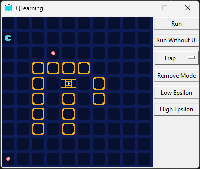

# L-Systems
## Popis problému
Cílem bylo implementovat L-systémy (Lindenmayerovy systémy), což jsou formální gramatiky používané pro modelování růstu rostlin a generování fraktálních vzorů.

## Proces implementace
1. **Struktura systému**:
   - `LSystemApp`: Třída pro vizualizaci a ovládání L-systémů.
   - Implementace generování řetězce podle pravidel.
   - Interpretace vygenerovaného řetězce jako grafických příkazů.

2. **Komponenty systému**:
   - Axiom: Počáteční řetězec.
   - Pravidla: Definice pro nahrazení symbolů.
   - Úhel: Určuje rotaci při kreslení.
   - Iterace: Počet aplikací pravidel.

3. **Proces generování**:
   ```python
   def generate_l_system(self, axiom, rule, iterations):
       current = axiom
       for _ in range(iterations):
           next_gen = []
           for char in current:
               if char == 'F':
                   next_gen.append(rule)
               else:
                   next_gen.append(char)
           current = "".join(next_gen)
       return current
   ```

4. **Interpretace symbolů**:
   - F: Pohyb vpřed s kreslením čáry
   - +: Rotace vlevo
   - -: Rotace vpravo
   - [: Uložení pozice
   - ]: Návrat na uloženou pozici

## Výsledek
L-systém úspěšně generuje komplexní geometrické vzory a fraktální struktury pomocí jednoduchých pravidel.

## Obrázeky
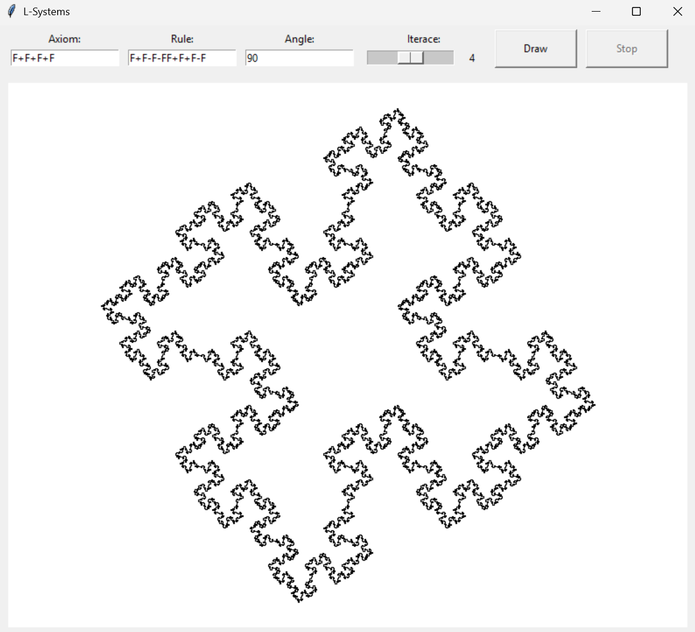
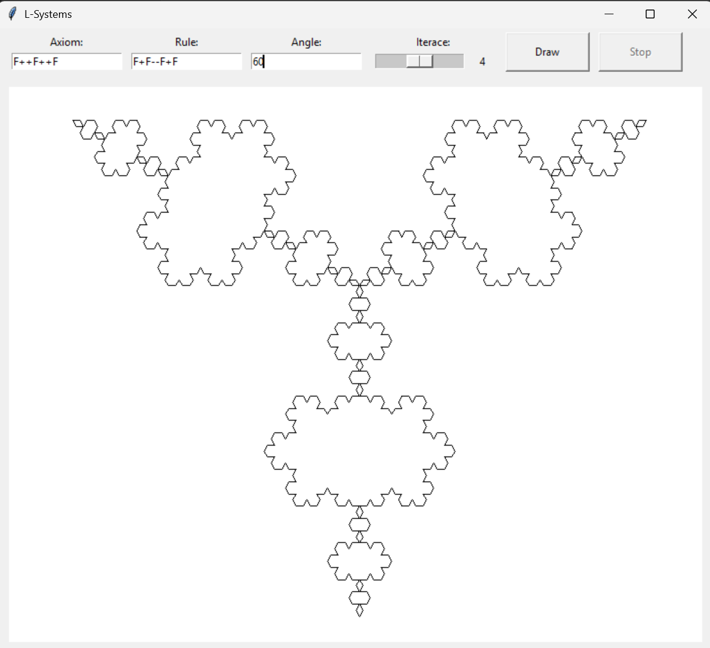
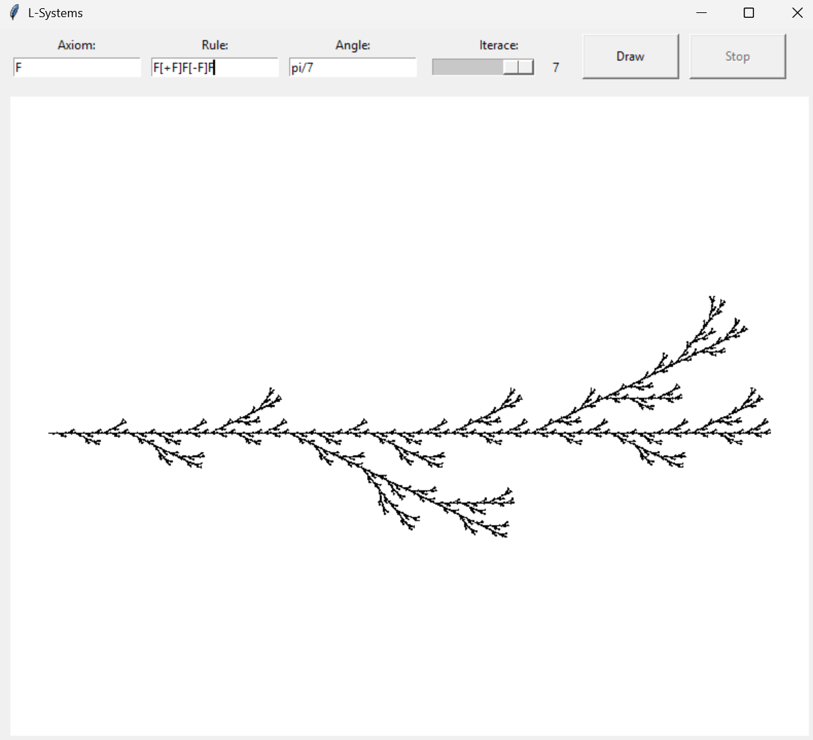

# IFS Fractals
## Popis problému
Cílem bylo implementovat Iterativní funkční systémy (IFS) pro generování fraktálů. IFS využívají sadu afinních transformací aplikovaných rekurzivně na body v prostoru k vytvoření složitých fraktálních struktur.

## Proces implementace
1. **Struktura systému**:
   - `IFSFractal`: Třída pro generování bodů fraktálu pomocí transformací.
   - `IFSGraph`: Třída pro vizualizaci vygenerovaných bodů.
   - Implementace pomocí náhodného výběru transformací a jejich iterativní aplikace.

2. **Hlavní komponenty**:
   - Sada transformací definovaných maticemi.
   - Generátor bodů pomocí náhodného procesu.
   - Vizualizační nástroje pro zobrazení výsledků.

3. **Proces generování**:
   ```python
   def generate_points(self, iterations:int, starting_point:np.ndarray=None):
       current_point = starting_point or np.array([0.0, 0.0, 0.0])
       points = np.zeros((iterations, 3))
       
       for i in range(iterations):
           transform_idx = random.choices(range(self.num_transforms), k=1)[0]            
           current_point = self.apply_transformation(current_point, transform_idx)
           points[i] = current_point
           
       return points
   ```

4. **Aplikace transformací**:
   - Pro afiní transformace se využívá rovnice viz obrázek, která je implementovaná v metodě `apply_transformation`.
   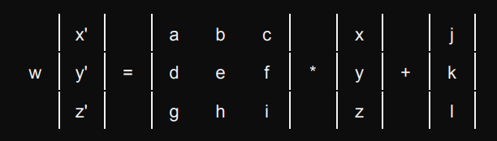
   ```python
   def apply_transformation(self, point:np.ndarray, transform_idx:int):
         a, b, c, d, e, f, g, h, i, j, k, l = self.transformations[transform_idx]
         x, y, z = point
         
         x_new = a * x + b * y + c * z + j
         y_new = d * x + e * y + f * z + k
         z_new = g * x + h * y + i * z + l
         
         return np.array([x_new, y_new, z_new])
   ```

## Výsledek
IFS úspěšně generuje komplexní fraktální struktury pomocí opakovaného aplikování transformací na body v prostoru.

## Obrázky
### IFS Fraktály
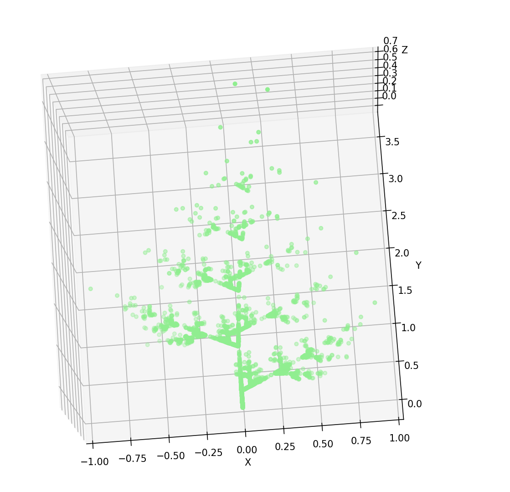
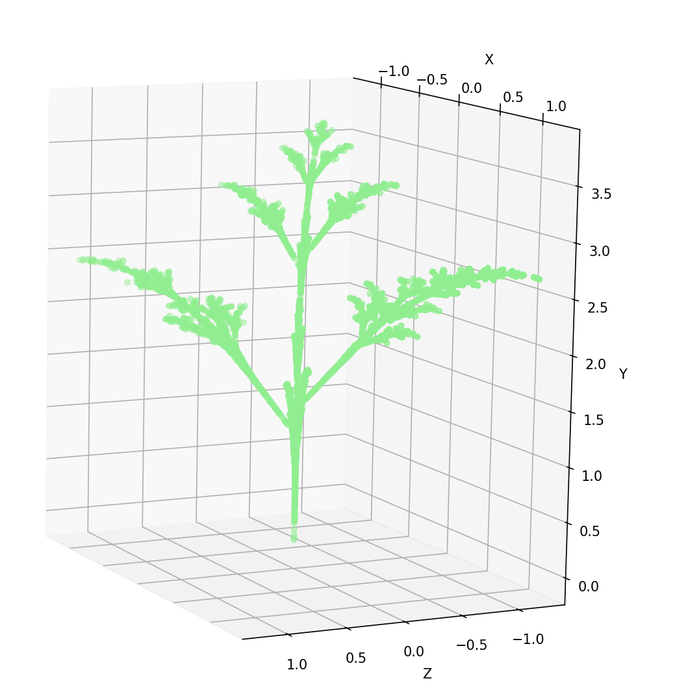

# TEA
## Popis problému
Cílem bylo implementovat aplikaci pro zobrazování a interakci s různými typy fraktálů. Aplikace umožňuje vizualizaci Mandelbrotovy a Juliovy množiny, s možností přiblížení, oddálení a úpravy počtu iterací pro detailnější zobrazení.

## Rozdíl mezi Mandelbrotovou a Juliovou množinou
Obě množiny používají stejnou iterativní rovnici `z_{n+1} = z_n^2 + c`, ale s různými přístupy:

- **Mandelbrotova množina**:
  - Počáteční hodnota `z_0 = 0` pro všechny body
  - Parametr `c` se mění pro každý bod v komplexní rovině
  - Existuje pouze jedna Mandelbrotova množina

- **Juliova množina**:
  - Parametr `c` je konstantní pro celý fraktál
  - Počáteční hodnota `z_0` je souřadnice bodu v komplexní rovině
  - Existuje nekonečně mnoho Juliových množin, jedna pro každou hodnotu `c`

## Proces implementace
1. **Struktura projektu**:
   - Vytvoření základní abstraktní třídy `Fractal`, která definuje společné rozhraní pro všechny typy fraktálů.
   - Implementace konkrétních tříd `MandelbrotSet` a `JuliaSet`, které dědí z této základní třídy.
   - Vytvoření třídy `FractalApp` pro GUI aplikace a interakci s uživatelem.

2. **Implementace třídy `Fractal`**:
   - Definice základních vlastností jako rozměry plátna, maximální počet iterací a meze pro zobrazení.
   - Implementace metody `zoom` pro přiblížení/oddálení na konkrétní bod ve fraktálu.
   - Abstraktní metoda `compute` pro výpočet konkrétního typu fraktálu.

3. **Implementace `MandelbrotSet` a `JuliaSet`**:
   - Výpočet hodnot komplexních bodů v definované oblasti.
   - Iterativní algoritmus pro určení příslušnosti bodů k dané množině.
   - Obarvení bodů na základě počtu iterací před "únikem" z množiny.

   ```python
   def compute(self):
       re = np.linspace(self.x_min, self.x_max, self.width)
       im = np.linspace(self.y_min, self.y_max, self.height)
       
       img_array = np.zeros((self.height, self.width, 3), dtype=np.uint8)
       
       for i in tqdm(range(self.width), "Computing"):
           for j in range(self.height):
               # Mandelbrot:
               c = complex(re[i], im[j])
               z = complex(0, 0)
               # Julia:
               # c je konstatní zadáne jako parametr
               z = complex(re[i], im[j])

               # Iterativní výpočet
               # ...
               
               # Obarvení bodu podle počtu iterací
               if iteration < self.max_iter:
                   hue = iteration / self.max_iter
                   r, g, b = colorsys.hsv_to_rgb(hue, 0.8, 1.0)
                   img_array[j, i] = (int(r * 255), int(g * 255), int(b * 255))
   ```

## Výsledek
Aplikace úspěšně zobrazuje Mandelbrotovu a Juliovu množinu s možností interaktivně prozkoumat různé části fraktálů.

## Obrázky
### Fraktály - Ukázky
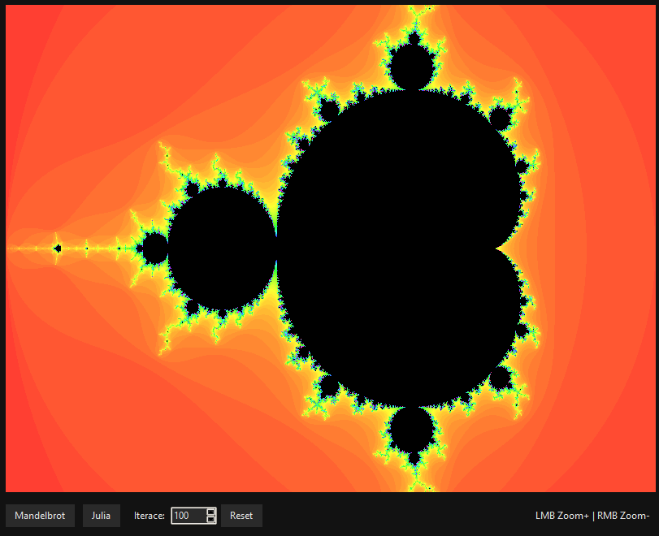
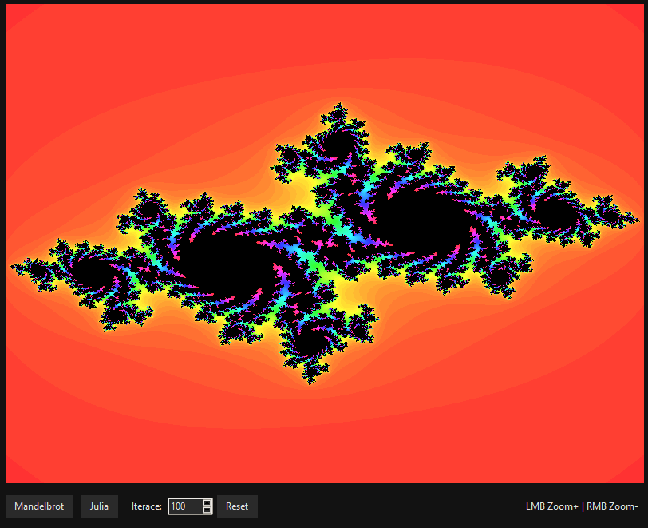
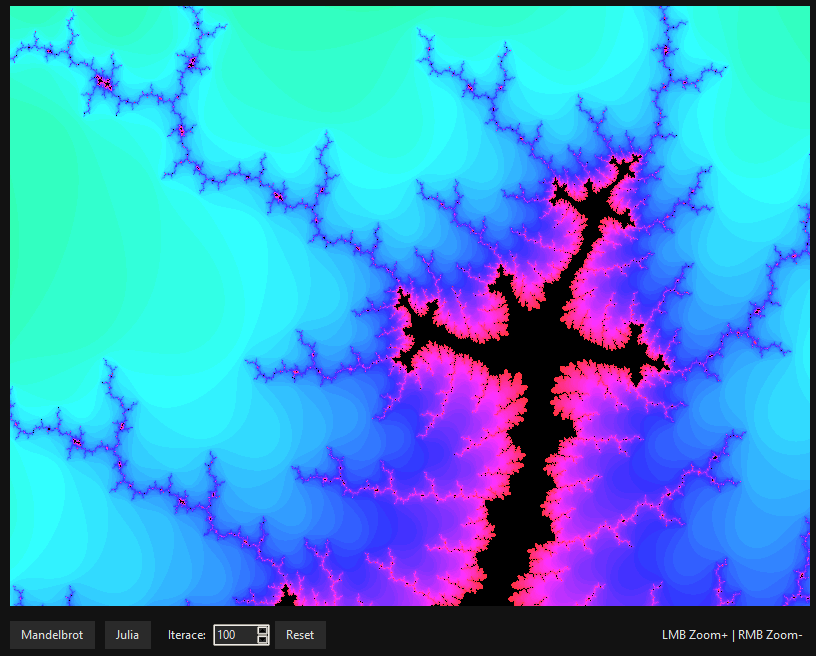

# Fractal Terrain
## Popis problému
Cílem bylo vytvořit aplikaci pro generování fraktálního terénu pomocí algoritmu midpoint displacement. Tento algoritmus vytváří realisticky vypadající krajinu pomocí rekurzivního rozdělování úseček a náhodného posouvání středových bodů.

## Proces implementace
1. **Struktura projektu**:
   - `TerrainSegment`: Třída reprezentující segment terénu (úsečku).
   - `TerrainLayer`: Třída pro uchování vrstvy terénu a její barvy.
   - `FractalTerrain`: Hlavní třída obsahující logiku pro generování fraktálního terénu.
   - `TerrainGenerator`: Třída spojující fraktální algoritmus s vizualizací.
   - `FractalTerrainApp`: GUI aplikace pro interakci s uživatelem.

2. **Algoritmus Midpoint Displacement**:
   - Začíná s jednou úsečkou definovanou počátečním a koncovým bodem.
   - Rekurzivně rozděluje každou úsečku na dvě poloviny.
   - Náhodně posouvá středový bod kolmo k původní úsečce.
   - S každou iterací snižuje míru náhodnosti pro vytvoření realističtějšího vzhledu.

   ```python
   def generate_layer(self, start_x, start_y, end_x, end_y, iterations, randomness=0.15):
      root_segment = TerrainSegment(start_x, start_y, end_x, end_y)
      segments = [root_segment]
      
      for i in range(iterations):
         new_segments = []
         current_randomness = randomness * (0.8 ** i)
         
         for segment in segments:
               mid_x, mid_y = segment.midpoint()
               
               # Výpočet kolmého vektoru pro posunutí bodu
               dx = segment.end_x - segment.start_x
               dy = segment.end_y - segment.start_y
               length = segment.length()
               
               # Náhodné posunutí středového bodu kolmo k úsečce
               if length > 0:
                  perpendicular_x = -dy / length
                  perpendicular_y = dx / length
                  
                  direction = 1 if random.random() > 0.5 else -1
                  random_offset = direction * random.random() * current_randomness * length
                  
                  new_mid_x = mid_x + perpendicular_x * random_offset
                  new_mid_y = mid_y + perpendicular_y * random_offset
                  
                  left_segment = TerrainSegment(segment.start_x, segment.start_y, new_mid_x, new_mid_y)
                  right_segment = TerrainSegment(new_mid_x, new_mid_y, segment.end_x, segment.end_y)
                  
                  new_segments.append(left_segment)
                  new_segments.append(right_segment)
                  
                  segment.children = [left_segment, right_segment]
               else:
                  new_segments.append(segment)
         
         segments = new_segments
      
      return segments
   ```

3. **Vyplnění terénu**:
   - Algoritmus nejen generuje linii terénu, ale také vyplňuje oblast pod linií barvou.
   - Využívá polygon pro vykreslení vyplněné oblasti mezi linií terénu a spodní hranicí plátna.

4. **Vrstvení terénu**:
   - Aplikace umožňuje přidávat více vrstev terénu na sebe s různými barvami.
   - Každá vrstva může mít jiné počáteční a koncové body a různý počet iterací.

## Výsledek
Aplikace úspěšně generuje realisticky vypadající terén s možností přidávat více vrstev a vytvářet tak komplexní krajiny.

## Obrázek
### Ukázka fraktálního terénu
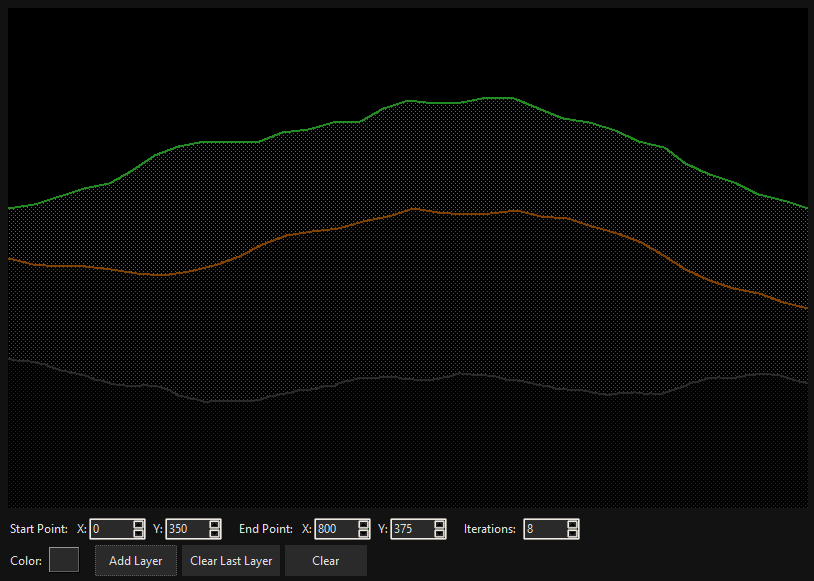